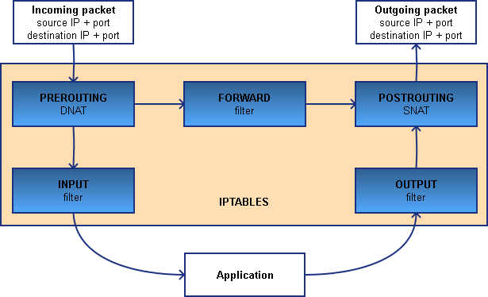

# Linux Network Server (level 3) <br /> Linux ցանցային սերվեր (փուլ 3)

## Linux firewall, packet filtering, iptables 

"Firewall" term is generally used for some mechanism to do **network security** and **traffic management** tasks.

**Linux firewall** mechanism is implemented in Linux kernel in form of network firewall capabilities to filter packets (called **Netfilter**).

Initially, Linux firewall was designed as **packet filter**. 
The goal was to define rules to permit, deny, or modify network traffic 
based on various criteria such as **source/destination IP addresses**, **ports**, and **protocols**.

So **Netfilter** is a framework within the Linux kernel that provides various functionalities for packet filtering.

But **Linux firewall** term also involves additional components on top of **Netfilter**. 
These are various tools to configure and manage it.
Different Linux distributions and versions use different tools.
Also some tools function on top of others.

We can call "**backend tools**" - those that directly interact with Netfilter (part of Linux kernel) to define firewall rules and manipulate network packets.

And "frontend tools" - higher-level tools that work on top of "**backend tools**".

Current "**backend tools**" in Linux firewall system are:

* **IPtables**
* **Nftables**

Among "**frontend tools**" in Linux firewall system are:

* **Firewalld**
* **Ufw (Uncomplicated Firewall)**

(there are also others like Shorewall, Ferm, ...)

Above tools offer various levels of complexity and features for configuring firewall. 
Some provide simple interface for basic firewall configuration, 
while others offer more advanced capabilities for managing complex firewall scenarios.

Below we mainly discuss `iptables`. Other tools are also mentioned a bit.


### IPtables
IPtables was basic tool to manage packet filtering, but newer Linux versions
provide other "front-end" tools for `iptables`.

Nftables is new tool meant to replace the aging iptables. 
Some distributions today are already moved to `nftables` and enable it by default. 
Others still keep enabled `iptables`, but have also already `nftables` present, which you need to enable manually.
We will shortly talk about 'nftables' later below.

As we said above in modern Linux versions there exist distribution-dependent 
higher-level "front-end" tools on top of iptables/nftables. 
For example **RH/CentOS** from version 7 and above come with an alternative service called `firewalld`
which fulfills this same purpose & **Ubuntu** versions now use `ufw` (Uncomplicated Firewall).

Also CentOS versions may have `iptables` as special package/service, 
with some predefined chains/rules.

> WHAT YOU NEED TO UNDERSTAND AND REMEMBER IS THAT PACKET **FILTERING ITSELF** IS KERNEL-BASED FUNCTION - **NETFILTER**
> ALL THE ABOVE TOOLS ARE JUST MEANS OF MANAGING THAT INSTRUMENT INSIDE LINUX KERNEL.

Now let's ensure we have clear config for learning we can check and stop/disable such services if any:

Check if we have have `iptables` service running/enabled:
```bash
systemctl is-active iptables ;\
systemctl is-enabled iptables
```
Disable/Stop it if needed:
```bash
systemctl --now disable iptables ;\
systemctl is-active iptables ;\
systemctl is-enabled iptables
```

Also check if we have have `firewalld` service running/enabled:
```bash
systemctl is-active firewalld ;\
systemctl is-enabled firewalld
```
Disable/Stop it if needed:
```bash
systemctl --now disable firewalld ;\
systemctl is-active firewalld ;\
systemctl is-enabled firewalld
```

And in case of Ubuntu we can do the same with `ufw`

```bash
systemctl is-active ufw ;\
systemctl is-enabled ufw
```
Disable/Stop it if needed:
```bash
systemctl --now disable ufw ;\
systemctl is-active ufw ;\
systemctl is-enabled ufw
```

Now we should have a clean initial configuration to start learning.

First we will get understanding of `iptables`, since it's anyway remaining
at the bottom of any modern netfilter-based Linux firewall.

When a packet passes through `iptables`, it passes a set of **chains**. 
Each chain contains set of **rules**.
Decisions what to do with packet is made by those **rules**.

Below command will give the list of all current active **chains** & **rules**. 
```bash
iptables -nvL
```





_(taken from: https://jensd.be/343/linux/forward-a-tcp-port-to-another-ip-or-port-using-nat-with-iptables)_

Basic chains are (plus PREROUTING, POSTROUTING):

* INPUT - for packets coming **into** the network interface from outside.


* FORWARD - for packets **transiting** between two network interfaces.


* OUTPUT - for packets going **out** from network interface to outside.

For each chain a sequence of **rules** with appropriate **actions** can be defined.

Each rule can specify filtering parameters (like Source/Destination IP address)
and if packet fits the **action** for that rule will be taken.

Basic actions are: 
* ACCEPT
* REJECT
* DROP

For each chain there is **default action** - final decision what to do with packets that did not fit any rule in that chain. 

Standard default action is **ACCEPT**.

<br>
<br>

#### PRACTICE

Add rule to INPUT chain:<br>
```bash
iptables -A INPUT -d 127.0.0.2 --jump REJECT
```

Check: `iptables -nvL`

Try if it works:
```bash
ping -c 1 127.0.0.2
```

Check again: `iptables -nvL` <br>
You should see 1 more packet (in **pkts** column) filtered for that rule.


Now remove that rule:
```bash
iptables -D INPUT -d 127.0.0.2 --jump REJECT 
``` 
It is also possible to remove all rules: 
```bash
iptables -F
````

Check:<br> `iptables -nvL`

Try if it works:
```bash
ping -c 1 127.0.0.2
```

We can allow only outgoing traffic.
Here we specify **default** rules with `-P` option:
```bash
iptables -P INPUT DROP ; \
iptables -A INPUT -m state --state RELATED,ESTABLISHED -j ACCEPT 
```

Last rule allows only those packets, which are parts of some already established session.

Check:
```bash
ping -c 2 8.8.8.8
```

```bash
iptables -nvL 
```

ping should work and you should see increase in number of 'pkts' for "RELATED,ESTABLISHED" chain

```bash
ping -c 2 127.0.0.1
```

```bash
iptables -nvL 
```
ping should not work and you should see increase in number of packets for default INPUT 'polycy DROP'

> * Can you explain the reason of this difference?

Now we can clear (flush) all rules<br> and restore default actions for INPUT & OUTPUT chains:
```bash
iptables -P INPUT ACCEPT  ;\
iptables -F 
```

And check the difference:
```bash
iptables -nvL
```

```bash
ping -c2 8.8.8.8
```

```bash
ping -c2 127.0.0.1
```

We can block some specific IP-address or subnet
```bash
iptables -A INPUT -s 8.8.8.8/16 -j DROP ;\
iptables -A INPUT -s 1.1.1.1 -j DROP
```

Check:
```bash
iptables -nvL
```

```bash
ping -c 2 8.8.8.8
```

```bash
ping -c 2 8.8.4.4
```

```bash
ping -c 2 1.1.1.1
```


> * Can you explain why ping doesn't work, when we only restricted INPUT ?


Clear:
```bash
iptables -F
```

Check:
```bash
iptables -nvL
```

```bash
ping -c 2 8.8.8.8
```

```bash
ping -c 2 8.8.4.4
```

```bash
ping -c 2 1.1.1.1
```

Now we set rules for OUTPUT chain
```bash
iptables -F ;\
iptables -A OUTPUT -d 8.8.8.8/16 -j DROP ;\
iptables -A OUTPUT -d 1.1.1.1 -j DROP
```

Check:
```bash
iptables -nvL 
```

```bash
ping -c 2 8.8.8.8
```

```bash
ping -c 2 8.8.4.4
```

```bash
ping -c 2 1.1.1.1
```

> * Can you explain the difference of restricting only INPUT or OUTPUT ?
> * Is one of them enough, or both are needed ?

We can block some port (note that the `-p` protocol option is required 
for ports)
```bash
iptables -A OUTPUT -p tcp --dport 80 -j DROP
```
 
Try:
```bash
telnet fb.com 80 
```

> * Change the rule to filter in INPUT chain


```bash
iptables -A INPUT -p tcp --dport 22 -j REJECT
```
 
Try:
```bash
ssh 127.0.0.1 
```

> * What the difference will be if we set 'DROP' instead of 'REJECT'

Clear:
```bash
iptables -F
```

We can combine multiple options in rules, and also 
specify the network interface <br>(`-i` for _incoming_ , `-o` for outgoing).

```bash
iptables -A OUTPUT -o lo -p icmp -d 127.1.2.3/24 --icmp-type echo-request -j REJECT --reject-with icmp-host-prohibited ;\
iptables -A INPUT -i enp0s3 -p icmp -s 9.9.9.9 --icmp-type echo-reply -j DROP
```

> NOTE: 
> 1. we filter once for INPUT and another time for OUTPUT 
> 2. depending on the expected packet we use different ICMP types:
>    * `--icmp-type echo-request` - for OUTPUT
>    * `--icmp-type echo-reply` - for INPUT

Try:
```bash
ping -c 2 127.1.2.3
```

```bash
ping -c 2 9.9.9.9
```

> ICMP error messages that can be added if **REJECT** method is used:<br>
>* `--reject-with icmp-host-prohibited`
>* `--reject-with icmp-net-prohibited`
>* `--reject-with icmp-net-unreachable`
>* `--reject-with icmp-host-unreachable`


We can limit the number of connections per IP address (uses **connlimit** module)
Here we allow only 1 SSH connection per IP address:
```bash
iptables -A INPUT -p tcp --syn -d 127.0.0.1 --dport 22 -m connlimit --connlimit-above 1 -j REJECT 
```
Now try connecting with ssh twice.
Login first time:
```bash
ssh student@127.0.0.1
```
Now connect second time:
```bash
ssh student@127.0.0.1
```

But below will work both times, since we block only 127.0.0.1

Login first time:
```bash
ssh student@127.0.0.2
```
Now connect second time:
```bash
ssh student@127.0.0.2
```


Multiple ports can be blocked in ine rule with **multiport** module
Here we block Microsoft-DS and Netbios ports for both TCP & UDP
```bash
iptables -A FORWARD -p tcp -m multiport --dport 445,137,138,139  -j DROP ;\
iptables -A FORWARD -p udp -m multiport --dport 445,137,138,139  -j DROP
```

Note that here *FORWARD* chain is used, so this is example of filtering **transit** traffic.


Mac-based blocking is also possible with **mac** module:
In this example we only accept traffic for TCP port 22 from mac 00:19:99:3C:AB:22 
```bash
iptables -A INPUT -p tcp --destination-port 22 -m mac --mac-source 00:19:99:3C:AB:22 -j ACCEPT ;\
iptables -A INPUT -p tcp --destination-port 22 -j REJECT
```

Examples with NAT

NAT is special case. To see NAT table specify table name with `-t nat`:
```bash
iptables -nvL -t nat
```

We need to set rules in special chain POSTROUTING:
```bash
iptables -t nat -A POSTROUTING -d 127.100.0.0/16 -j SNAT --to-source 127.5.5.5 ;\
iptables -t nat -A POSTROUTING -d 127.200.0.0/16 -j SNAT --to-source 127.7.7.7
```

Try connecting to localhost with different IPs to see the effect of NAT rules
```bash
ssh student@127.100.0.1
```

```bash
w
```

```bash
ssh student@127.200.0.1
```

```bash
w
```

You should see **student** logins from:
* 127.5.5.5
* 127.7.7.7

To clear/drop all current rules in NAT table specify table name with `-t`
```bash
iptables -F -t nat
```

#### Nftables

The `nftables` is developed by **Netfilter**, the same organization that currently maintains `iptables`. 
It was created as a better variant than `iptables` and is very similar to it.
It has some improvements, for example, with `nftables` you can create both IPv4 and IPv6 rules at one place and keep them in sync.
(in case of `iptables` you had to do separate IPv6 rule config with separate tool `ip6tables`)

> In fact `nftables` replaces not only `iptables` and `ip6tables`, but also 
> `arptables` (for ARP rules) and `ebtables` (for Ethernet Bridge rules), 
> that we don't discuss here.

`nftables` has been included in the Linux kernel since 2014, (since Linux kernel 3.13)
and  it still slowly becomes more popular.

Nftables scheme is _(taken from https://wiki.nftables.org/wiki-nftables/index.php/Netfilter_hooks)_:


You can try to determine whether your Linux is currently includes Nftables, using the following methods:

1. Check for `nft` command:
```bash
which nft
```
If `nft` is found, it suggests NFtables package is installed (doesn't mean it is used by default)

2. Check for `nftables` config
```bash
find /etc -name "nftables*"
```
If `nftables.conf` is found, it suggests NFtables package is installed (doesn't mean it is used by default)

3. Check Service Status:

Check if `nftables` is running/enabled as service:
```bash
systemctl is-active nftables ;\
systemctl is-enabled nftables
```

Remember that even if `nftables` is disabled as a service you can still use 
command tools from this package to manage kernel filter.
The service itself only manages its configuration, not the filter itself.

Even more the rules you set with `netfilter` and `iptables` are to some extent managable by another tool.

##### Syntax difference between iptables and nftables
The syntax of `nftables` is different than syntax of `iptables`.

But there is `iptables-translate` utility, which will accept `iptables` options and convert them to the `nftables` equivalent. 
This is an easy way to see how the two syntaxes differ.

Let’s see some examples so that you can see how these commands differ from each other.

This command would block incoming connections from IP address `127.1.2.7`:
```bash
iptables-translate -A INPUT -s 127.1.2.7 -j DROP
```
You can now run the result of the above command.
and check if that rule has been added:
```bash
iptables -nvL | grep '127.1.2.7'
```

Also we can remove it with `iptables`
```bash
iptables -D INPUT -s 127.1.2.7 -j DROP
```

and check if that rule has been removed:
```bash
iptables -nvL | grep '127.1.2.7'
```

More examples:

Allow incoming SSH connections:
```bash
iptables-translate -A INPUT -p tcp --dport 22 -m conntrack --ctstate NEW,ESTABLISHED -j ACCEPT
```
You can now run the result of the above command.
and check if that rule has been added:

```bash
iptables -nvL | grep '22'
```

You can notice warning:
`table `filter' is incompatible, use 'nft' tool.`

So you can use the `nft` tool
```bash
nft list ruleset
```


Or with more details:

```bash
nft list table ip filter
```

This demonstrates that in real life it is not so smooth to use one tool instead of another.
This brings us to
> IMPORTANT NOTE:
> To prevent the different firewalling/packet filtering services/tools from influencing each other, 
> run only one of them per Linux host, and disable the other services.


More info:
* https://access.redhat.com/documentation/ru-ru/red_hat_enterprise_linux/8/html/configuring_and_managing_networking/getting-started-with-nftables_configuring-and-managing-networking
* https://linuxhandbook.com/iptables-vs-nftables/
* https://netfilter.org/projects/nftables/
* https://habr.com/ru/companies/ruvds/articles/580648/>
* https://www.server-world.info/en/note?os=Ubuntu_22.04&p=nftables&f=2


#### Firewalld

**firewalld** is a zone-based firewall.

Each zone contains several actions, based on set of defined rules. 
Rules are applied against incoming/outgoing packets.

Zone is associated with at least one network interface.

Firewalld Basic Operation is available at:

* https://www.redhat.com/sysadmin/beginners-guide-firewalld
* https://access.redhat.com/documentation/ru-ru/red_hat_enterprise_linux/8/html/configuring_and_managing_networking/using-and-configuring-firewalld_configuring-and-managing-networking
* https://www.server-world.info/en/note?os=CentOS_Stream_8&p=firewalld&f=1
* https://www.digitalocean.com/community/tutorials/how-to-set-up-a-firewall-using-firewalld-on-centos-8
* https://www.digitalocean.com/community/tutorials/how-to-set-up-a-firewall-using-firewalld-on-centos-8-ru


#### UFW

UFW is also the frontend tool of nftables/iptables for Debian/Ubuntu.

UFW Basic Operation is available at:

* https://www.server-world.info/en/note?os=Ubuntu_22.04&p=ufw&f=1
* https://www.digitalocean.com/community/tutorials/how-to-set-up-a-firewall-with-ufw-on-ubuntu-22-04
* https://www.digitalocean.com/community/tutorials/ufw-essentials-common-firewall-rules-and-commands

