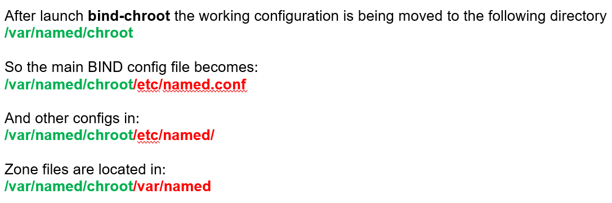

# Linux Network Server (level 3) <br /> Linux ցանցային սերվեր (փուլ 3)

## DNS Server (BIND, Berkeley Internet Name Domain/Daemon)

Basic knowledge of DNS is essential for this part.

Some URLs:

* http://www.kloth.net/services/dig.php
* https://simpledns.plus/lookup-dg
* http://dns.squish.net/


### Install additional DNS utilities

We may need few DNS utilities:
`dig [options] <domain/ip> <name-server>`

`host [options] <domain/ip> <name-server>`

You may need to install bind-utils package:
```bash
yum -y install bind-utils
```

Use examples:

`host -t aaaa gmail.com 8.8.8.8`

`dig -t soa ya.ru @8.8.8.8`

`host -v fb.com`

`host -a mail.ru`

`host 8.8.4.4 8.8.8.8`

`dig -x 8.8.4.4 @8.8.8.8`


### Install BIND & prepare chroot environment


We will use BIND package for DNS server. BIND is free and one of the most widespread solution for implementation of Domain Name System (DNS) server.
CentOS has special package for secure DNS server configuration `bind-chroot`.


BIND Installation:
```bash
yum -y install bind-chroot
```

Non-chroot BIND version (if any) should be stopped and disabled	
```bash
systemctl disable --now named
```

Setup chroot environment for BIND:
```bash
/usr/libexec/setup-named-chroot.sh /var/named/chroot on
```

Enable and start service
```bash
systemctl enable --now named-chroot
```

Check
```bash
ps ax | grep named
netstat -nlptu | grep named
ss -nlptu | grep named
```

Since SELinux (Security-Enhanced Linux) and firewalld 
may cause problems, we will turn them off for the training period.

Turn off firewalld
```bash
systemctl disable --now firewalld
```
or allow DNS ports

```bash
firewall-cmd --add-port=53/udp ; \
firewall-cmd --add-port=53/tcp
```

Check if SELinux is on

```bash
getenforce
```

Turn off SELinux if needed

```bash
setenforce 0
```

Permanent changes need to be done in `/etc/sysconfig/selinux` file

```bash
# SELINUX=enforcing
SELINUX=disabled`
```

### BIND basic configuration

Main BIND config file is `/etc/named.conf`
Also additional configs may be in: `/etc/named/`

But in case of **bind-chroot** there is a trick.

After launch **bind-chroot** the working configuration 
is being moved to the following directory `/var/named/chroot`

> Thus all WORKING ACTIVE configuration has preceding
> `/var/named/chroot` prefix added to the path of any config file.



So the main BIND config file becomes:	
`/var/named/chroot/etc/named.conf`

And other configs are now in:
`/var/named/chroot/etc/named/`

Zone files are located in:
`/var/named/chroot/var/named`

> IMPORTANT ! <br>
> If **bind-chroot** is **RUNNING**, then edit `named.conf` or other 
> config/zone files **in chroot environment**, under 
> `/var/named/chroot`
> (for example `/var/named/chroot/etc/named.conf`)
> <br><br>
> If **bind-chroot** is STOPPED then edit `named.conf` or other 
> config/zone files in their default locations
> `/etc/` & `/var/named`
> (for example `/etc/named.conf`)
> 
> Don't forget to restart **bind-chroot** after each configuration change.


#### Make few changes in default config

Default config listens only to `127.0.0.1` and serves only queries from `localhost`

We will change it for training purposes.
Open `/var/named/chroot/etc/named.conf`

find section `options { … }`
and change:
> listen-on port 53 { 127.0.0.1; };	

to	
> listen-on port 53 { any; }; 

also change:
> allow-query     { localhost; };

to

> allow-query     { any; }; 


### BIND configuration for master zone

> Each student should create own domain zone:
> lt0x.am  (x – student’s number assigned by teacher)
> Teacher’s zone will be lt01.am,  
> Students zones: lt02.am, lt03.am, …
> (here and below each student should change the number x 
> to his/her number assigned by teacher 
> REMEMBER to include green part if bind-chroot is started 
> and to omit it if bind-chroot is stopped)
> Also IP address `10.10.x.1` should be changed everywhere below to match the student's number. 


#### Create master zone data file `/var/named/chroot/var/named/lt0x.am.db`

> IMPORTANT ! Before running command edit it and change `x` everywhere to match your domain & IP address.

```bash
cat  > /var/named/chroot/var/named/lt0x.am.db  << "EOF1"
$TTL 1H
@       SOA     ns.lt0x.am.     dns.lt0x.am. (
                          2023090100 ; serial
                          3H ; refresh
                          1H ; retry
                          1W ; expire
                          1H ; minimum
                          )
                          NS      ns.lt0x.am.
                          MX      0 mail
                          A       10.10.x.1
www                       A       10.10.x.1
ns                        A       10.10.x.1
mail                      A       10.10.x.1
EOF1

```


#### Create master zone config file `/var/named/chroot/etc/named/lt0x.am.zone`

> IMPORTANT ! Before running command edit it and change `x` everywhere to match your domain & IP address.

```bash
cat  > /var/named/chroot/etc/named/lt0x.am.zone  << "EOF1"
zone "lt0x.am." IN {
        type master;
        file "lt0x.am.db";
};
EOF1

```

#### Include it in main config file `/var/named/chroot/etc/named.conf`

> IMPORTANT ! Before running command edit it and change `x` everywhere to match your domain & IP address.


```bash
cat  >> /var/named/chroot/etc/named.conf  << "EOF1"
include "/etc/named/lt0x.am.zone";
EOF1

```


#### Restart the `named-chroot` BIND service

```bash
systemctl restart named-chroot
```


#### Check

```bash
host -t ns lt0x.am 127.0.0.1
```

```bash
host -t a lt0x.am 10.10.x.1
```

```bash
dig -t soa lt0x.am @127.0.0.1
```

```bash
dig -t mx lt0x.am @10.10.x.1
```

### Configure the system to use your local DNS server 

Let's configure the Linux server system to use our local DNS server we have just implemented. 
Our goal is to have access to both our local domains `lt02.am`, ... as well as the internet dns system. 

In order to do that you should change `/etc/resolv.conf` and set `nameserver 127.0.0.1` before any other `nameserver` lines.

But the problem is that in case of dynamic IP configuration via DHCP, that configuration will be overwritten next time it will be updated.

To solve that issue we need to tweak configuration as follows.

#### Set static DNS servers that they are not reset after each DHCP update

1. Create static `/etc/resolv.conf` config and prevent it from being overwritten by setting special _immutable_ attribute.

```bash
mv /etc/resolv.conf /tmp ;\
echo `nameserver 127.0.0.1` >/etc/resolv.conf ;\
chattr +i /etc/resolv.conf

```


2. Change Network Manager configuration to prevent from overwriting DNS settings <br>
(to get more info on below run `man NetworkManager.conf` and search for `dns` and `rc-manager` in that manual)


```bash
nano /etc/NetworkManager/NetworkManager.conf
```

Under `[main]` section add following lines:

```bash
dns=none
rc-manager=unmanaged
```

Restart NetworkManager 

```bash
systemctl restart NetworkManager
```

Check that your system now uses your DNS server (as you may note, the difference is that we don't specify the server `127.0.0.1` as last option)

```bash
host -t soa lt0x.am
```

```bash
dig -t soa lt0x.am
```

#### PRACTICE

Add second nameserver record for slave DNS server, you will configure below.

* new NS resource record in your zone `lt0x.am.` 
  * type:		NS 
  * value:	ns2.lt0x.am.

* new A resource record for `ns2`
  * name:   ns2 
  * type:   A 
  * value:  10.10.x.10


### Reverse Zones

Create Reverse Zone    `x.10.10.in-addr.arpa.`

1.Create master reverse zone config file `/var/named/chroot/etc/named/10.10.x.zone`

> IMPORTANT ! Before running command edit it and change `x` everywhere to match your domain & IP address.

```bash
cat  > /var/named/chroot/etc/named/10.10.x.zone  << "EOF1"
zone "x.10.10.in-addr.arpa." IN {
         type master;
         file "10.10.x.rev.db";
};
EOF1

```

2.Include it in main config file `/var/named/chroot/etc/named.conf`


```bash
cat  >> /var/named/chroot/etc/named.conf  << "EOF1"
include "/etc/named/10.10.x.zone";
EOF1

```

3.Create master reverse zone data file `/var/named/chroot/var/named/10.10.x.rev.db`

> IMPORTANT ! Before running command edit it and change `x` everywhere to match your domain & IP address.

```bash
cat  > /var/named/chroot/var/named/10.10.x.rev.db  << "EOF1"
$TTL 1H
@       SOA     ns.lt0x.am.     dns.lt0x.am. (
                          2023090100 ; serial
                          3H ; refresh
                          1H ; retry
                          1W ; expire
                          1H ; minimum
                          )
                          NS		ns.lt0x.am.
1                         PTR		www.lt0x.am.
2                         PTR		ns.lt0x.am.
3                         PTR		mail.lt0x.am.
EOF1

```


4.Restart the service
```bash
systemctl restart named-chroot 
```

5.Check
```bash
host 10.10.x.1 127.0.0.1 ;\
dig -x 10.10.x.1 @127.0.0.1
```

#### PRACTICE

1. Add new PTR resource record in your zone `x.10.10.in-addr.arpa.`

  * type:		PTR
  * name:       10
  * value:	    ns2.lt0x.am.

2.Add new NS resource record in your zone `1.10.10.in-addr.arpa.`

  * type:		NS
  * value:	    ns2.lt0x.am.


### Slave Zones

On another server install bind-chroot and create configuration to get zone copy as Slave Zone.

1.Create slave zone config file `/var/named/chroot/etc/named/lt0x.am.zone`


```bash
cat  > /var/named/chroot/etc/named/lt0x.am.zone  << "EOF1"
zone "lt0x.am." IN {
        	type slave;
masters { 10.10.x.1; };
        	file "slaves/lt0x.am.db";
 	masterfile-format text;
};
EOF1

```

2.Include that configuration in main config file `/var/named/chroot/etc/named.conf`

```bash
cat  >> /var/named/chroot/etc/named.conf << "EOF1"
include "/etc/named/lt0x.am.zone";
EOF1
```


3.Restart the service
```bash
systemctl restart named-chroot
```

If no config errors made "Zone transfer" should take place
and local file `/var/named/chroot/var/named/slaves/lt0x.am.db` should appear.

Check if the slave zone data file `/var/named/chroot/var/named/slaves/lt0x.am.db` was created
```bash
ls -l /var/named/chroot/var/named/slaves
```

```bash
cat /var/named/chroot/var/named/slaves/lt0x.am.db
```

Check that our local service gives result from slave zone (no need to specify the server as `127.0.0.1` as we set it above in `/etc/resolv.conf`):
```bash
host -t soa lt0x.am
```

```bash
dig -t soa lt0x.am
```

#### PRACTICE

1. Create configuration to get a Slave Zone copy for zone `x.10.10.in-addr.arpa`

2. Configure Master-Slave notification-based instant updates by configuring the following on Master server.
   1. Ensure NS records for the domain hav proper IP addresses for Master and Slave server 
      1. ns.lt0x.am - IP address of Master server
      2. ns2.lt0x.am - IP address of Slave server<br><br>
   2. Activate sending of instant zone change notification from master to slaves, by addind in section `options { … }` of `/var/named/chroot/etc/named.conf`
   the option `notify yes;`<br><br>
   3. Restart Master and check result in Slave `/var/named/chroot/var/named/data/named.run`.

### Additional slave zones for centralized DNS 

Teacher will create additional slave zones for each student's domain

1. Add third nameserver record for teacher's slave DNS server

* new NS resource record in your zone `lt0x.am.` 
  * type:		NS 
  * value:	ns3.lt0x.am.

* new A resource record for `ns3`
  * name:   ns3 
  * type:   A 
  * value:  10.10.x.111
  
2. Add new PTR resource record in your zone `x.10.10.in-addr.arpa.`

* new PTR resource record in your zone `lt0x.am.` 
  * type:		PTR
  * name:       111
  * value:	    ns3.lt0x.am.
  

> Now teacher will configure slave zones for each domain.
> 
> Then can need to change your `/etc/resolv.conf` to point to teacher's IP address.
>
> As a result your server will "know" about all student's domains !


### Advanced configuration:
There are lots of other options for advanced BIND configuration. 
Options can be specified both in main `options { … }` part, 
as well as in each zone description parts `zone lt0x.am. IN { ... }`

Examples:
Below we can see how to 
   1. Hide BIND Version
   2. Define limited functionality of recursion & zone transfer
   3. Use ACLs for flexible configuration (which is useful in case you specify the same subnet multiple times in configuration) 
```
acl local-ips   { 172.16.1.0/24; 192.168.0.0/16; 10.0.0.0/8; };  
acl slave-ips   { 192.168.0.0/16; };  
options {
	version "GO AWAY";	// Hide BIND Version
	allow-transfer {		// Zone Transfers allowed only for slaves
                127.0.0.1/32;           	
                 slave-ips;             	
                 };
	allow-recursion {  		// Recursion allowed only for local IPs
                127.0.0.1/32;           	
                 local-ips;            	
                 }; 
	   };
```

_HINT: You can try to find out the BIND version with:_
```bash
dig chaos txt version.bind @127.0.0.1
```
