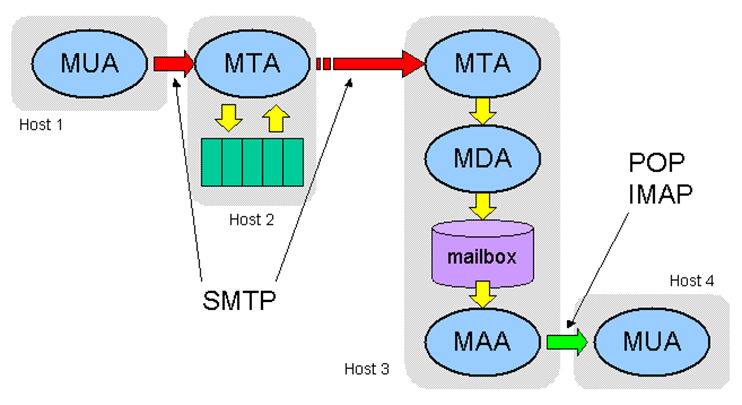

# Linux Network Server (level 3) <br /> Լինուքս ցանցային սերվեր (փուլ 3)

## Email service, Mail server (Postfix, Dovecot)
_(partially based on https://www.server-world.info/en/note?os=CentOS_8&p=mail&f=1)_

### How email works (MTA, MDA, MUA)

Email is based around the use of electronic mailboxes. 
When an email is sent, the message is routed from server to server, 
all the way to the recipient's email server. 
More precisely, the message is sent to the mail server tasked 
with transporting emails (called the **MTA**, for Mail Transport Agent) 
to the recipient's **MTA**. On the Internet, **MTA**s communicate with one 
another using the protocol **SMTP** (Simple Mail Transfer Protocol), 
and so are logically called SMTP servers (or sometimes "outgoing mail servers"). 

The recipient's **MTA** then delivers the email to the incoming mail server 
(called the **MDA**, for Mail Delivery Agent), 
which stores the email as it waits for the user to retrieve it. 
**MAA** (Mail Access Agent) is used to retrieve mails from  mailboxes.

There are two main protocols used for retrieving email from MAA: 
* **POP3** (Post Office Protocol), the older of the two, which is used for retrieving email and, in certain cases, leaving a copy of it on the server. 

* **IMAP** (Internet Message Access Protocol), which is used for coordinating the status of emails (read, deleted, moved) across multiple email clients. With IMAP, a copy of every message is saved on the server, so that this synchronization task can be completed. 

For this reason, _incoming mail servers_ (**MAA**s) 
are called **POP** servers or **IMAP** servers, 
depending on which protocol is used. 



To use a real-world analogy, **MTA**s act as the post office 
(the sorting area and mail carrier, which handle message transportation), 
while **MDA**s act as mailboxes, which store messages 
(as much as their volume will allow) until the recipients check the box. 
This means that it is not necessary for recipients to be connected in 
order for them to be sent email. 

That is why Email service is not considered an **online** service, but instead is "**store-and-forward**" service 

To keep everyone from checking other users' emails, **MAA** is protected by login/password. 
Retrieving mail is done using a software program called an **MUA** (Mail User Agent). 
When the **MUA** is a program installed on the 
user's system, it is called an email client 
(such as Mozilla Thunderbird, Microsoft Outlook). 

When it is a web interface used for interacting with the 
incoming mail server, it is called **Webmail**. 

### Ensure you have prepare DNS configuration

Before going to mail server, let's ensure you have prepared the DNS system for that.

#### Separate domains for each student

* Each student should have configured separate domain **master** zone (lt01.am,lt02.am,lt03.am,...)
* Trainer will configure **slave** zones for each such domain (lt01.am,lt02.am,lt03.am,...)
* Make sure your Linux system has trainer's IP in /etc/resolv.conf as first `nameserver`. As a result all will know about all domains.


#### Define hostname

Ensure that the hostname of each student to match appropriate separate domain (lt01.am,lt02.am,lt03.am,...).

```bash
hostname 
```

If not, set the proper hostname

```bash
hostnamectl set-hostname lt0x.am
```


### Disable Firewalld or add the rules

We can disable Firewalld service

```bash
systemctl disable --now firewalld
```

or we can allow needed network ports (SMTP ports for Postfix and POP/IMAP ports for Dovecot)

```bash
firewall-cmd --add-service={smtp,smtps,pop3,pop3s,imap,imaps} --permanent ;\
firewall-cmd --reload
```

### Install & configure Postfix as SMTP Server

Install Postfix

```bash
yum -y install postfix
```

Configure Postfix

Change 2 lines in main config file `/etc/postfix/main.cf` 

Make Postfix listen all network interfaces instead localhost only:

```bash
sed -i.bak 's/inet_interfaces = localhost$/inet_interfaces = all/' /etc/postfix/main.cf
```

Add our domain to the destination to get mails for it:

```bash
sed -i.bak 's/mydestination = $myhostname, localhost.$mydomain, localhost$/mydestination = $myhostname, localhost.$mydomain, localhost, $mydomain/' /etc/postfix/main.cf
```

Add following to `/etc/postfix/main.cf` 

> REMEMBER to change `x` in 2 places to your number !
 
```bash
cat >> /etc/postfix/main.cf << 'END7'
# Added for Linux training
myhostname = lt0x.am
mydomain = lt0x.am
myorigin = $mydomain
mynetworks = 127.0.0.0/8, 10.0.0.0/8
home_mailbox = Maildir/
smtpd_banner = $myhostname ESMTP
# SMTP-Auth setting
smtpd_sasl_type = dovecot
smtpd_sasl_path = private/auth
smtpd_sasl_auth_enable = yes
smtpd_sasl_security_options = noanonymous
smtpd_sasl_local_domain = $myhostname
smtpd_recipient_restrictions = permit_mynetworks, permit_auth_destination, permit_sasl_authenticated, reject
END7
```


Enable and start Postfix:
```bash
systemctl enable --now postfix
```

### Install Dovecot to configure POP/IMAP Server.

Install Dovecot 
```bash
yum -y install dovecot
```

Configure Dovecot to provide SASL (Simple Authentication and Security Layer) capability to Postfix

Listen all IPs

```bash
echo 'listen = *' >> /etc/dovecot/dovecot.conf
```

Allow plaintext auth

```bash
echo 'disable_plaintext_auth = no' >> /etc/dovecot/conf.d/10-auth.conf
```

```bash
sed -i.bak 's/plain$/plain login/' /etc/dovecot/conf.d/10-auth.conf
```

Define mailbox place

```bash
echo 'mail_location = maildir:~/Maildir' >> /etc/dovecot/conf.d/10-mail.conf
```


Enable `postfix` to use `dovecot` for auth

Open `10-master.conf`

```bash
nano +107 /etc/dovecot/conf.d/10-master.conf
```

Uncomment lines as follows

```bash
# Postfix smtp-auth
  unix_listener /var/spool/postfix/private/auth {
  mode = 0666
  }
```

Change SSL option to be not required

```bash
sed -i.bak 's/ssl = required$/ssl = yes/' /etc/dovecot/conf.d/10-ssl.conf
```

Enable and start Dovecot:
```bash
systemctl enable --now dovecot
```

We have configured basic Postfix & Dovecot settings.
We can now create some new Linux OS user account to test email

> NOTE: Modern production solutions of mailserver are more complex 
> and generally use some database (like MySQL) to store email user data.
> But for this training we will use basic Linux user variant

Install simple terminal mail client program
```bash
dnf -y install s-nail
```
Set environment variables to use Maildir:
```bash
echo 'export MAIL=$HOME/Maildir' >> /etc/profile.d/mail.sh
```

Add a user `tester`
```bash
useradd tester ;\
passwd tester
```

Now try the above mail sending with `telnet`

Install telnet if needed
```bash
dnf -y install telnet
```

#### Add **Rsyslog** configuration to log Postfix and Dovecot logs separately.


```bash
cat > /etc/rsyslog.d/postfix.conf << "ENDTEXT"
if $programname == "postfix" then /var/log/postfix.log
ENDTEXT

```

```bash
cat > /etc/rsyslog.d/dovecot.conf << "ENDTEXT"
if $programname == "dovecot" then /var/log/dovecot.log
ENDTEXT

```

Restart rsyslog, postfix, dovecot
```bash
systemctl restart {rsyslog,postfix,dovecot} && systemctl is-active {rsyslog,postfix,dovecot}
```

Check

```bash
tail /var/log/postfix.log
```

Check

```bash
tail /var/log/dovecot.log
```


#### SMTP Session example
Try following example

```bash
telnet lt0x.am 25
```

> Trying 192.168.1.1...
> Connected to lt0x.am.
> Escape character is '^]'.
> 220 lt0x.am SMTP on Fri, 3 Aug 2001 10:38:06 +0400

```bash
helo lo
```

> 250 Hello root@lt0x.am, pleased to meet you

```bash
mail from: user@yahoo.com
```
> 250 user@yahoo.com... Sender ok

```bash
rcpt to: tester@lt0x.am     
```

> 250 tester@lt0x.am... Recipient ok

```bash
data
```

> 354 Enter mail, end with "." on a line by itself

```bash
From: "TEST" <test@mail.com>
To: "TEST" <test@mail.com>
Subject: Test message
Date: Mon, 02 Feb 1991 13:00:57 +0400

Hello, This is a test message.

Greetings,
Linux Trainer
.
```

> 250 KAA24894 Message accepted for delivery

```bash

quit
```


Try sending mail via terminal `mail` command 
```bash
mail tester@lt0x.am
```

Type some text the press `Ctrl-D` to send mail.


Switch to `tester` user 

```bash
su - tester
```

Check mail (type `q` to exit  `mail` program)

```bash
mail
```

Check logs

`exit` from `tester` to  `root` first.

```bash
tail /var/log/postfix.log
```

Send mail to Trainer's server

```bash
mail tester@lt00.am
```

Check logs

```bash
tail /var/log/postfix.log
```

Check mail queue

```bash
mailq
```

## Mail client configuration

Make changes in DNS configuration to have additional records for incoming and outgoing servers.<br>
This helps for **Mail client autoconfiguration**.

* Add `smtp.lt0x.am`  record

  * name:   `smtp` 
  * type:   `A` 
  * value:  `10.10.x.1`

* Add `imap.lt0x.am`  record

  * name:   `imap` 
  * type:   `A` 
  * value:  `10.10.x.1`

<br><br>

Now install and configure `thunderbird` graphical Mail Client. 

```bash
yum -y install thunderbird
```


>
>  Portable Windows version is at:
> `https://portableapps.com/apps/internet/thunderbird_portable`
>


> IMPORTANT! When configuring Mail Client specify username as `tester` without domainname, 
> since we use Linux users as test users.
> In production nowadays mailbox users are generally not related to Linux users, 
> but are created separately in some database, like MySQL.


## Webmail infterface

Here we try to install and use `Snappymail` (https://snappymail.eu/)

Prepare directory and get the package

```bash
mkdir -p /var/www/lt0x.am/webmail && cd /var/www/lt0x.am/webmail
```

Install `wget`

```bash
dnf -y install wget
```

Download Snappymail, extract it and remove original tarball file.

```bash
wget --inet4-only https://snappymail.eu/repository/latest.tar.gz && tar -xzf latest.tar.gz && rm -f latest.tar.gz
```

Set proper permissions

```bash
find /var/www/lt0x.am/webmail -type d -exec chmod 755 {} \; &&  find /var/www/lt0x.am/webmail -type f -exec chmod 644 {} \;
```

```bash
chown -R apache:apache /var/www/lt0x.am/webmail
```

Now try accessing  `http://apache.lt0x.am/webmail`

> You can use web browser in your windows, and set proxy server to trainer's Squid (that knows all our domains)
> so that when you will type URL, proxy server make DNS resolution and should work.
> Of course SSL certificate will remain self-signed, so you will get the warning about that.

You should be able to login to Snappy Web Mail with user `tester@lt0x.am`
(Also you need to manually create folders Sent, ...)

You should see incoming mails and send mails to yourself <br>
**but will not be able to send to others yet**.

You need to enable authorization for external sending.

```bash
sed -i.bkp 's/"useAuth": false/"useAuth": true/' /var/www/lt0x.am/webmail/data/_data_/_default_/domains/lt0x.am.json
```

Now try sending mails to Trainer's test mail address `tester@lt00.am`


> NOTE! Production installation requires Admin access configuration according to:
> https://github.com/the-djmaze/snappymail/wiki/Installation-instructions#now-access-the-admin-page
 
<br>
<br>


> Since we had problems with ip forwarding, so direct access between students is not working, 
> below we will configure mail routing via Trainer's server

## Mail routing


Mail routing may be organised in two steps:

* Public MX-based routing
  * to specify destination of incoming mails.
  <br>
* Mail server configuration to forward mails to some mailserver
  

### MX configuration to route mails via central Hub (Trainer's Server)

Change the `MX` record in your zone `lt0x.am`

Instead of

`MX      0 mail`

it should be

`MX      0 mail.lt00.am`

It means that your messages should be sent to Trainer's mailserver

and restart the `named-chroot` process.

Now your domain mails will be sent to Trainer's server.  
But it doesn't mean they will be accepted there.
To have them accepted Trainer needs to add some configuration there too.

In order mail for some domain to be accepted by mailserver
it should either be registered as: 
1. **local domain**, or 
2. **domain to forward mails somewhere**.

Below Trainer configure the second variant for student's domains.

### Configuration of central Hub (Trainer's Server)

**STUDENT'S DON'T NEED TO DE BELOW SECTION**

Trainer should add following lines to `/etc/postfix/transport`

With contents:
```bash
cat >> /etc/postfix/transport << "ENDTEXT"
lt01.am smtp:[mail.lt01.am]:25
lt02.am smtp:[mail.lt02.am]:25
lt03.am smtp:[mail.lt03.am]:25
lt04.am smtp:[mail.lt04.am]:25
lt05.am smtp:[mail.lt05.am]:25
lt06.am smtp:[mail.lt06.am]:25
lt07.am smtp:[mail.lt07.am]:25
lt08.am smtp:[mail.lt08.am]:25
lt09.am smtp:[mail.lt09.am]:25
lt10.am smtp:[mail.lt10.am]:25
lt11.am smtp:[mail.lt11.am]:25
lt12.am smtp:[mail.lt12.am]:25
lt13.am smtp:[mail.lt13.am]:25
lt14.am smtp:[mail.lt14.am]:25
lt15.am smtp:[mail.lt15.am]:25
ENDTEXT
```
 
> IMPORTANT !   <br>
> Mentioning mailserver name in square brackets   <br>
> like `[mail.lt01.am]`  <br>
> forces to send mails directly to that name's IP address  <br>
> otherwise (if specified without square brackets)  <br>
> mailserver will try to first make MX check and the send mails to  <br>
> IP address of host specified in highest priority MX record  <br>
> 


Build that config
```bash
postmap /etc/postfix/transport
```


Add that to Postfix main config file `/etc/postfix/main.cf`

```bash
cat >> /etc/postfix/main.cf << "ENDTEXT"
transport_maps = hash:/etc/postfix/transport
ENDTEXT

```

Restart Postfix

```bash
systemctl restart postfix
```

Now:
* try to send mail from one student to another 
* and check logs where do they go.


### Mail Log Report : pflogsumm

Install `pflogsumm` which is the Postfix Log reporting tool.

```bash
yum -y install postfix-perl-scripts
```


Generate mail log summary for today
```bash
pflogsumm -d today -e /var/log/maillog | less
```

Generate mail log summary for whole log file
```bash
pflogsumm -e /var/log/postfix.log | less
```
