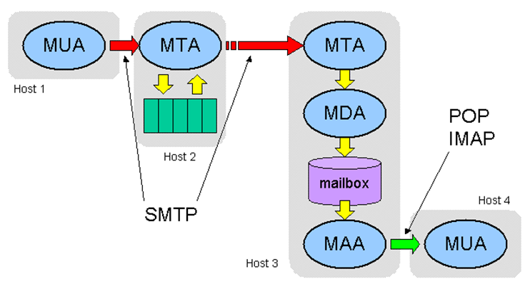

# Linux Network Server (level 3) <br /> Linux ցանցային սերվեր (փուլ 3)

## Email service, Mail server (Postfix, Dovecot)
_(partially based on https://www.server-world.info/en/note?os=CentOS_8&p=mail&f=1)_

### How email works (MTA, MDA, MUA)

Email is based around the use of electronic mailboxes. 
When an email is sent, the message is routed from server to server, 
all the way to the recipient's email server. 
More precisely, the message is sent to the mail server tasked 
with transporting emails (called the **MTA**, for Mail Transport Agent) 
to the recipient's **MTA**. On the Internet, **MTA**s communicate with one 
another using the protocol **SMTP** (Simple Mail Transfer Protocol), 
and so are logically called SMTP servers (or sometimes "outgoing mail servers"). 

The recipient's **MTA** then delivers the email to the incoming mail server 
(called the **MDA**, for Mail Delivery Agent), 
which stores the email as it waits for the user to retrieve it. 
**MAA** (Mail Access Agent) is used to retrieve mails from  mailboxes.

There are two main protocols used for retrieving email from MAA: 
* **POP3** (Post Office Protocol), the older of the two, which is used for retrieving email and, in certain cases, leaving a copy of it on the server. 


* **IMAP** (Internet Message Access Protocol), which is used for coordinating the status of emails (read, deleted, moved) across multiple email clients. With IMAP, a copy of every message is saved on the server, so that this synchronization task can be completed. 

For this reason, _incoming mail servers_ (**MAA**s) 
are called **POP** servers or **IMAP** servers, 
depending on which protocol is used. 





To use a real-world analogy, **MTA**s act as the post office 
(the sorting area and mail carrier, which handle message transportation), 
while **MDA**s act as mailboxes, which store messages 
(as much as their volume will allow) until the recipients check the box. 
This means that it is not necessary for recipients to be connected in 
order for them to be sent email. 

That is why Email service is not considered an **online** service, but instead is "**store-and-forward**" service 

To keep everyone from checking other users' emails, **MAA** is protected 
by a user name called a login and by a password. 
Retrieving mail is done using a software program called an **MUA** 
(Mail User Agent). When the **MUA** is a program installed on the 
user's system, it is called an email client 
(such as Mozilla Thunderbird, Microsoft Outlook). 

When it is a web interface used for interacting with the 
incoming mail server, it is called **Webmail**. 

### Ensure you have prepare DNS configuration

Before going to mail server, let's ensure you have prepared the DNS system for that.

#### Separate domains for each student

* Each student should have configured separate domain **master** zone (lt01.am,lt02.am,lt03.am,...)
* Teacher will configure **slave** zones for each such domain (lt01.am,lt02.am,lt03.am,...)
* Make sure your Linux system has teacher's IP in /etc/resolv.conf as first `nameserver`. As a result all will know about all domains.


#### Define hostname

Set the hostname of each student to match appropriate separate domain (lt01.am,lt02.am,lt03.am,...).

```bash
hostnamectl set-hostname lt0x.am ; hostname 
```


### Install & configure Postfix as SMTP Server

Install Postfix.

```bash
yum -y install postfix
```

Configure Postfix

Open `/etc/postfix/main.cf` and go to line 95 (_first line we want to edit now_)
```bash
nano +95 /etc/postfix/main.cf
```
or
```bash
vi +95 /etc/postfix/main.cf
```

> In `nano` goto the some line number with `Ctrl-Shift-_`
> 
> In `vi`   goto the some line number  with `Esc`, 
> then type the line number, and then press `Shift-g`
> 
> Just `Esc`+`Shift-g` will take you to the end of file

```bash	
# goto line 95: uncomment and specify hostname
myhostname = lt0x.am
# goto line 102: uncomment and specify domain name
mydomain = lt0x.am
# goto line 118: uncomment
myorigin = $mydomain
# goto line 135: change
inet_interfaces = all
# goto line 183: add
mydestination = $myhostname, localhost.$mydomain, localhost, $mydomain
# goto line 283: uncomment and specify your local network
mynetworks = 127.0.0.0/8, 10.0.0.0/8
# goto line 438: uncomment (use Maildir)
home_mailbox = Maildir/
# goto line 593: add
smtpd_banner = $myhostname ESMTP

# add following to the end of file

# SMTP-Auth setting
smtpd_sasl_type = dovecot
smtpd_sasl_path = private/auth
smtpd_sasl_auth_enable = yes
smtpd_sasl_security_options = noanonymous
smtpd_sasl_local_domain = $myhostname
smtpd_recipient_restrictions = permit_mynetworks, permit_auth_destination, permit_sasl_authenticated, reject

```


Enable and start Postfix:
```bash
systemctl enable --now postfix
```

Disable Firewalld
```bash
systemctl disable --now firewalld
```
> In case of active Firewalld we will need to allow SMTP ports for Postfix and POP/IMAP ports for Dovecot. <br>
> ```bash
> firewall-cmd --add-service={smtp,smtps,pop3,pop3s,imap,imaps} --permanent ;\
> firewall-cmd --reload
> ```
> But we will not do that for this training.
>

### Install Dovecot to configure POP/IMAP Server.

Install Dovecot 
```bash
yum -y install dovecot
```

Configure Dovecot to provide SASL (Simple Authentication and Security Layer) capability to Postfix

```bash
nano +30 /etc/dovecot/dovecot.conf
```

```bash
# add following after line 30
listen = *
```

```bash
nano +10 /etc/dovecot/conf.d/10-auth.conf
```

```bash
# add following after line 10
disable_plaintext_auth = no
# go to line 100: and change as follows
auth_mechanisms = plain login
```

```bash
nano +30 /etc/dovecot/conf.d/10-mail.conf
```
```bash
# add following after line 30
mail_location = maildir:~/Maildir
```

```bash
nano +107 /etc/dovecot/conf.d/10-master.conf
```

```bash
# uncomment line 107-109 and add some lines as follows
# Postfix smtp-auth
  unix_listener /var/spool/postfix/private/auth {
    mode = 0666
    user = postfix
    group = postfix
  }
```

```bash
nano +8 /etc/dovecot/conf.d/10-ssl.conf
```

```bash
# change line 8 as follows (means SSL is not required)
ssl = yes
```

Enable and start Dovecot:
```bash
systemctl enable --now dovecot
```

We have configured basic Postfix & Dovecot settings.
We can now create some new Linux OS user account to test email

> NOTE: Modern production solutions of mailserver are more complex 
> and generally use some database (like MySQL) to store email user data.
> But for this training we will use basic Linux user variant

Install simple terminal mail client program
```bash
yum -y install mailx
```
Set environment variables to use Maildir:
```bash
echo 'export MAIL=$HOME/Maildir' >> /etc/profile.d/mail.sh
```

Add a user `tester`
```bash
useradd tester ;\
passwd tester
```

Now try the above mail sending with `telnet`

Install telnet if needed
```bash
yum -y install telnet
```


#### SMTP Session example
Try following example

```bash
telnet lt0x.am 25
```

> Trying 192.168.1.1...
> Connected to lt0x.am.
> Escape character is '^]'.
> 220 lt0x.am SMTP on Fri, 3 Aug 2001 10:38:06 +0400

```bash
helo lo
```

> 250 Hello root@lt0x.am, pleased to meet you

```bash
mail from: user@yahoo.com
```
> 250 user@yahoo.com... Sender ok

```bash
rcpt to: tester@lt0x.am     
```

> 250 tester@lt0x.am... Recipient ok

```bash
data
```

> 354 Enter mail, end with "." on a line by itself

```bash
From: "TEST" <test@mail.com>
To: "TEST" <test@mail.com>
Subject: Test message
Date: Mon, 02 Feb 1991 13:00:57 +0400

Hello, This is a test message.

Yours truly,
Administrator
.
```

> 250 KAA24894 Message accepted for delivery

```bash

quit
```


Try sending mail via terminal `mail` command 
```bash
mail tester@lt0x.am
```

Switch to `tester` user and check mail
(type `q` to exit  `mail` program)
```bash
su - tester
mail
```

> Additionally `thunderbird` graphical Mail Client can be installed either on Windows or Linux
> `yum -y install thunderbird`

### Mail Log Report : pflogsumm

Install `pflogsumm` which is the Postfix Log reporting tool.

```bash
yum -y install postfix-perl-scripts
```

Generate mail log summary for today
```bash
perl /usr/sbin/pflogsumm -d today /var/log/maillog | less
```

